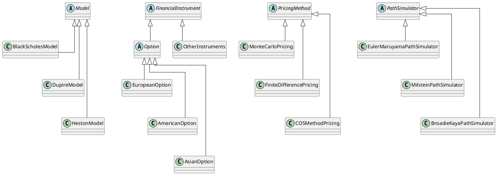

## UML Class Diagram

```plantuml
@startuml
top to bottom direction
skinparam linetype ortho

' ===== Model Hierarchy =====
abstract class Model
class BlackScholesModel
class DupireModel  
class HestonModel

BlackScholesModel --|> Model
DupireModel       --|> Model
HestonModel       --|> Model

' Force vertical stacking for Model group
Model -[hidden]down- BlackScholesModel
BlackScholesModel -[hidden]down- DupireModel
DupireModel -[hidden]down- HestonModel

' ===== Financial Instrument Hierarchy =====
abstract class FinancialInstrument
abstract class Option
class EuropeanOption
class AmericanOption
class AsianOption
class OtherInstruments

FinancialInstrument <|-- Option
FinancialInstrument <|-- OtherInstruments
EuropeanOption --|> Option
AmericanOption --|> Option
AsianOption    --|> Option

' Force vertical stacking for FinancialInstrument group
FinancialInstrument -[hidden]down- Option
FinancialInstrument -[hidden]down- OtherInstruments
Option -[hidden]down- EuropeanOption
EuropeanOption -[hidden]down- AmericanOption
AmericanOption -[hidden]down- AsianOption

' ===== Pricing Method Hierarchy =====
abstract class PricingMethod
class MonteCarloPricing
class FiniteDifferencePricing
class COSMethodPricing

MonteCarloPricing       --|> PricingMethod
FiniteDifferencePricing --|> PricingMethod
COSMethodPricing        --|> PricingMethod

' Force vertical stacking for PricingMethod group
PricingMethod -[hidden]down- MonteCarloPricing
MonteCarloPricing -[hidden]down- FiniteDifferencePricing
FiniteDifferencePricing -[hidden]down- COSMethodPricing

' ===== Path Simulator Hierarchy =====
abstract class PathSimulator
class EulerMaruyamaPathSimulator
class MilsteinPathSimulator
class BroadieKayaPathSimulator

EulerMaruyamaPathSimulator --|> PathSimulator
MilsteinPathSimulator      --|> PathSimulator
BroadieKayaPathSimulator   --|> PathSimulator

' Force vertical stacking for PathSimulator group
PathSimulator -[hidden]down- EulerMaruyamaPathSimulator
EulerMaruyamaPathSimulator -[hidden]down- MilsteinPathSimulator
MilsteinPathSimulator -[hidden]down- BroadieKayaPathSimulator

' ===== Horizontal spacing between hierarchies =====
Model -[hidden]right- FinancialInstrument
FinancialInstrument -[hidden]right- PricingMethod  
PricingMethod -[hidden]right- PathSimulator

@enduml
```
